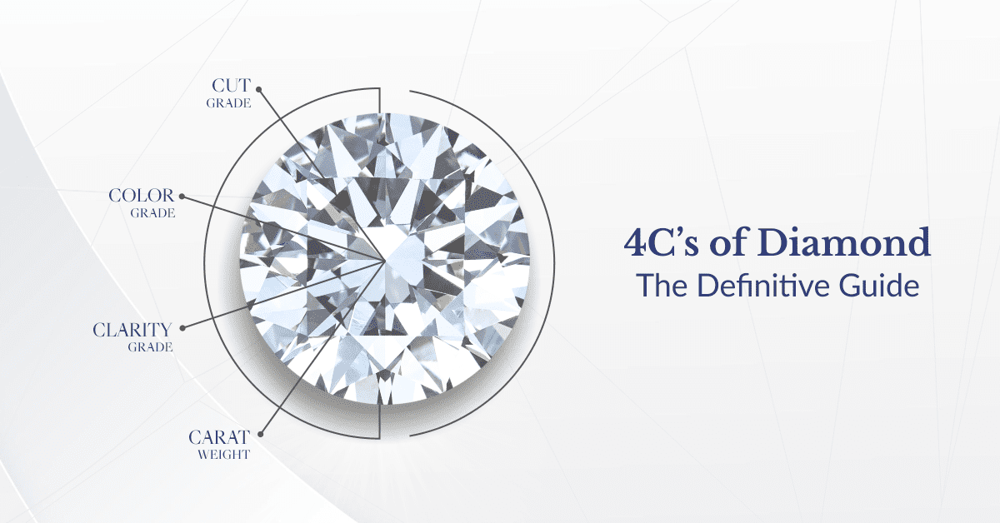

# Diamond Price Prediction Using Machine Learning 

# Data Source :- 
Kaggle (Diamond Price Dataset with 50,000 records).

Features:- 
1) Numerical: Carat, Dimensions (x, y, z). 
2) Categorical: Cut (Fair, Good, Very Good, Premium, Ideal), Color (J to D), Clarity (I1 to IF). 
3) **Target Variable:-** Price in USD. 

# Problem Statement ‼️
In the diamond industry, accurate pricing is a critical challenge due to the variability of diamond features such as carat, cut, colour, clarity, and dimensions. 
The pricing process often involves manual evaluation, which can be subjective and inconsistent. 
This creates the need for a robust and data-driven solution to estimate diamond prices reliably and transparently.

# Objective 📌
The objective of this project is to predict the price of diamonds based on key features such as carat, cut, color, clarity, and dimensions. By leveraging machine learning techniques, the project aims to build an accurate predictive model that can estimate diamond prices, providing insights for the jewelry industry and potential buyers

# Aim 🎯
The aim is to:
1) Analyze the relationship between various diamond features and their price.
2) Build and evaluate multiple machine learning models to identify the most accurate one.
3) Utilize Random Forest, a tree-based model, as the primary algorithm to predict diamond prices.
4) Retain outliers in the dataset to reflect real-world variability and ensure realistic predictions.

# Methodology 
**Data Preparation:-** 
1) Perform exploratory data analysis (EDA) to identify patterns and trends. 
2) Handle missing data (if any) and ensure consistent formatting. 
3) Retain outliers as they reflect valid variability in diamond characteristics.

# Insigths & Visuals

1) Scatter Plot of Carat Vs Price
.png)

2) Scatter Plot of Size Vs Price
.png)

3) Heat Map For Correlation Matrix

4) Feature Impoartace

# Model Development

1) Build and evaluate both tree-based models (e.g., Decision Tree, Random Forest, XGBoost) and scaling-based models (e.g., Linear Regression, KNN, SVR). 
2) Perform hyperparameter tuning using GridSearchCV to optimize model performance. 

# Challenges ⚔️
1) **Outliers:-** Managing outliers to ensure they do not overly bias the model while retaining their valid variability. 
2) **Categorical Features:-** Encoding qualitative attributes like cut, color, and clarity effectively for both tree-based and scaling-based models. 
3) **Model Tuning:-** Balancing computation time during hyperparameter tuning for a large dataset.

# Model Performance Comparison

| **Model**           | **Train R²**   | **Test R²**    | **Train MSE**       | **Test MSE**       |
|----------------------|----------------|----------------|---------------------|---------------------|
| **Decision Tree**    | 0.886651       | 0.877203       | 1.814021e+06        | 1.842908e+06        |
| **Random Forest**    | 0.897212       | 0.879838       | 1.645005e+06        | 1.803351e+06        |
| **XGBoost**          | 0.887510       | 0.879653       | 1.800265e+06        | 1.806139e+06        |
| **AdaBoost**         | 0.869742       | 0.866318       | 2.084621e+06        | 2.006263e+06        |
| **Linear Regression**| 0.852629       | 0.851238       | 2.358506e+06        | 2.232572e+06        |
| **SVR**              | 0.855425       | 0.851829       | 2.313748e+06        | 2.223712e+06        |
| **KNN**              | 0.898196       | 0.870080       | 1.629253e+06        | 1.949793e+06        |

# Actual Vs Predicted Diamond Prices

# Summary 

diamond price analysis and prediction using the Python programming language. 
According to the diamond price analysis, 
we can say that the price and size of premium diamonds are higher than other types of diamonds. 

# Conclusion 

Impact of Models:-
Accurate diamond price predictions help jewelers, buyers, and insurers determine fair prices.

Best Model: 
XGboost, due to its high R2 and low MSE on both training and test sets.

Good Alternatives: 
Random Forest , Decison Tree and KNN also show strong performance.

Baseline Models: 
Linear Regression and SVR provide good baselines but are outperformed by ensemble methods.

# Practical Applications 💁

1) **E-Commerce Platforms :-** Automating pricing recommendations for diamonds listed on online marketplaces. 

2) **Inventory Management :-** Helping jewelers value their inventory based on consistent pricing. 

3) **Fraud Detection :-** Identifying discrepancies in diamond pricing for authentication and fraud prevention. 

4) **Customer Decision Support :-** Assisting customers in understanding and justifying diamond prices during purchases. 
